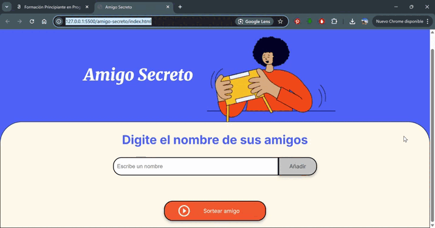

# 🎁 Amigo Secreto - Sorteo de Nombres

<div align="center">
  
  <br>
  
  
  
  
</div>

## 📑 Índice
1. [Descripción](#-descripción)
2. [Funcionalidades](#-funcionalidades)
3. [Demo](#-demo)
4. [Tecnologías](#-tecnologías)
5. [Distribución de Lenguajes](#-distribución-de-lenguajes)
6. [Instalación](#-instalación)
7. [Uso](#-uso)
8. [Contribución](#-contribución)
9. [Autor](#-autor)
10. [Licencia](#-licencia)
11. [Contacto](#-contacto)

## 📌 Descripción
**Amigo Secreto** es una aplicación web basica, nivel principiante que permite organizar sorteos para intercambios de regalos entre amigos, familiares o compañeros de trabajo.
Responde a la actividad requerida por el bootcamp de la plataforma de aprendizaje de programación [ONE] https://app.aluracursos.com/.
El objetivo principal de este desafío es desarrollar habilidades en lógica de programación, esta enfocado exclusivamente en construir la lógica del código JavaScript, aplicando conceptos clave como funciones, arrays, condicionales y variables, lo que permite centrarme en resolver el problema y mejorar el razonamiento lógico, sin preocuparme por la estructura visual del proyecto, ya que fue proporcionada por Alura Latam.

🔹 **Características principales:**
- Interfaz simple e intuitiva
- Validación de entrada de datos (solo texto)
- Sorteo completamente aleatorio
- Diseño responsivo (funciona en móviles y desktop)
- Visualización clara de resultados

## ✨ Funcionalidades
<div align="center">
  <table>
    <tr>
      <th>Función</th>
      <th>Descripción</th>
    </tr>
    <tr>
      <td><b>Añadir participantes</b></td>
      <td>Agrega nombres a la lista de sorteos</td>
    </tr>
    <tr>
      <td><b>Validación de entrada</b></td>
      <td>Solo acepta texto (no números/símbolos)</td>
    </tr>
    <tr>
      <td><b>Visualización de lista</b></td>
      <td>Muestra todos los participantes</td>
    </tr>
    <tr>
      <td><b>Sorteo aleatorio</b></td>
      <td>Asignación justa mediante algoritmo random</td>
    </tr>
  </table>
</div>

## 🎥 Demo
<div align="center">
  
  <p><em>Proceso completo de añadir participantes y realizar sorteo</em></p>
</div>

## 💻 Tecnologías
<div align="center">
  
  
  
</div>

## 📊 Distribución de Lenguajes
<div align="center">
  
  

</div>

## 📥 Instalación
1. **Clona el repositorio**:
   
   git clone https://github.com/calderflor/amigo-secreto.git

2. **Abre el archivo principal**

Navega hasta la carpeta del proyecto

Abre el archivo index.html en tu navegador

Requisitos del sistema:

✔ Navegador moderno (Chrome 90+, Firefox 88+, Edge 90+)

✔ Conexión a Internet (para cargar fuentes de Google)

✔ 100MB de espacio disponibleClona el repositorio**:

## 🤝 Contribución
¡Tus contribuciones son bienvenidas! Sigue estos pasos:

1. Haz fork al proyecto
2. Crea tu rama (`git checkout -b feature/nueva-funcion`)
3. Haz commit de tus cambios (`git commit -m 'Añade nueva funcion'`)
4. Haz push a la rama (`git push origin feature/nueva-funcion`)
5. Abre un Pull Request

**Requisitos para contribuir:**
- Sigue el estilo de código existente
- Documenta cualquier cambio importante
- Actualiza el README si es necesario

## 👤 Autor
<div align="center">
<a href="https://github.com/calderflor">
<br />
<sub><b>Flor Calderón</b></sub>
</a>
<br />
<a href="https://github.com/calderflor/amigo-secreto/commits?author=calderflor" title="Contribuciones">💻</a>
</div>

## 📜 Licencia
Este proyecto está bajo la licencia MIT - ver el archivo LICENSE para más detalles.

```text
MIT License

Copyright (c) 2025 Flor Calderón

Permiso otorgado para usar, copiar, modificar, fusionar, publicar, distribuir...

## 🤝 Contribución 
¡Tus contribuciones son bienvenidas! Sigue estos pasos:

1. Haz fork al proyecto
2. Crea tu rama (`git checkout -b feature/nueva-funcion`)
3. Haz commit de tus cambios (`git commit -m 'Añade nueva funcion'`)
4. Haz push a la rama (`git push origin feature/nueva-funcion`)
5. Abre un Pull Request

**Requisitos para contribuir:**
- Sigue el estilo de código existente
- Documenta cualquier cambio importante
- Actualiza el README si es necesario

## 👤 Autor
<div align="center">
<a href="https://github.com/calderflor">
<br />
<sub><b>Flor Calderón</b></sub>
</a>
<br />
<a href="https://github.com/calderflor/amigo-secreto/commits?author=calderflor" title="Contribuciones">💻</a>
</div>

## 📜 Licencia
MIT License

Copyright (c) 2025 Flor Calderón

Permiso otorgado para usar, copiar, modificar, fusionar, publicar, distribuir...

## 📧 Contacto
¿Preguntas o sugerencias? ¡Contáctame!

✉️ Email: calder_83@hotmail.com  
🔗 GitHub: @calderflor
